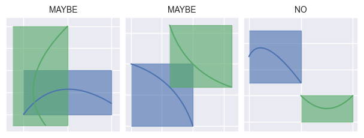
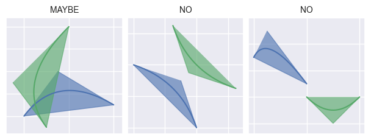
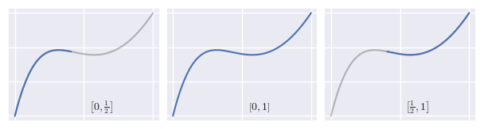
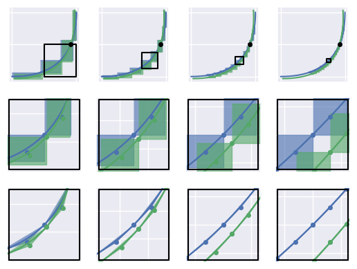
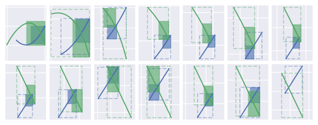

Geometric Curve Intersection
============================

.. contents::
   :local:

.. |eacute| unicode:: U+000E9 .. LATIN SMALL LETTER E WITH ACUTE
   :trim:

The problem of intersecting two curves is a difficult one
in computational geometry. The :meth:`.Curve.intersect` method (when using
the :attr:`~.IntersectionStrategy.GEOMETRIC` strategy) uses a combination of
curve subdivision, bounding box intersection, and curve approximation (by
lines) to find intersections.

Bounding Box Predicate
----------------------

Rather than directly trying to find intersection points between curve-curve
pairs, an predicate check is used to rule out pairs that are "too far" to
intersect.

Since the Bernstein weights are non-negative (when
:math:`s \in \left[0, 1\right]`) and sum to :math:`1`, a planar
B |eacute| zier curve can always be found within the polygon formed by the
convex hull of the control points. By similar logic, the curve will also be
contained in the bounding box defined by the extreme values in the :math:`x`
and :math:`y` directions, and this bounding box is much simpler to compute
than the convex hull.

An intersection check between two bounding boxes amounts to checking if the
intervals overlap in each of the :math:`x` and :math:`y` directions, whereas
arbitrary convex polygon intersection is much more involved
(though the `Sutherland-Hodgman`_ clipping algorithm exists) and the :math:`x`
and :math:`y` components are not independent. In order to **eliminate** pairs
of curves that are gauranteed **not** to intersect, a bounding box predicate
can be used.

.. _Sutherland-Hodgman: https://en.wikipedia.org/wiki/Sutherland%E2%80%93Hodgman_algorithm

As we can see from the middle column, this predicate may produce some false
positives, but is a cheaper alternative to a convex hull intersection
predicate:

Curve Subdivision
-----------------

If the bounding boxes for a pair of curves are not disjoint, each curve
:math:`\mathcal{C} = b\left(\left[0, 1\right]\right)` is split into two halves
by splitting the unit interval:
:math:`b\left(\left[0, \frac{1}{2}\right]\right)`
and :math:`b\left(\left[\frac{1}{2}, 1\right]\right)`:

The subdivision process continues to use a simple tool (the bounding box
predicate) to narrow in on pairs of subintervals where an intersection may
occur:

.. image:: ../images/subdivision_process.png
   :align: center

In cases where curves are **almost** parallel, the number of subdivided
candidate pairs can become too large. When the number of candidates
exceeds a certain threshold, we use the convex hull predicate instead to prune
the number of pairs:

Subdividing Until Linear
------------------------

In addition to limiting the input range from :math:`\left[0, 1\right]` to
a more focused interval where intersection can occur, the subdivision process
also serves the purpose of "linearizing" the curve segments:

After a sufficient number of subdivisions, the :func:`.linearization_error`
of each segment in a pair will drop below a given threshold.

By symmetry this also holds for the right side. Thus, the error bound

.. math::

   E = \frac{\left\lVert\Delta^2 \mathbf{p}_0\right\rVert_2}{4}

becomes

.. math::

   E^{(L)} = \frac{\left\lVert\Delta^2 \mathbf{p}_0^{(L)}\right\rVert_2}{4} =
   \frac{\frac{1}{4} \left\lVert\Delta^2 \mathbf{p}_0\right\rVert_2}{4} =
   \frac{1}{4} E.
