Curve-Curve Intersection
========================

.. testsetup:: *

   import bezier
   import numpy as np

   def binary_exponent(value):
       if value == 0.0:
           return -np.inf
       _, result = np.frexp(value)
       # Shift [1/2, 1) --> [1, 2) borrows one from exponent
       return result - 1

The problem of intersecting two curves is a difficult one
in computational geometry. The :meth:`.Curve.intersect` method (when using
the :attr:`~.IntersectionStrategy.GEOMETRIC` strategy) uses a combination of
curve subdivision, bounding box intersection, and curve approximation (by
lines) to find intersections.

Curve-Line Intersection
-----------------------

.. doctest:: intersect-1-8
   :options: +NORMALIZE_WHITESPACE

   >>> nodes1 = np.asfortranarray([
   ...     [0.0, 0.5, 1.0],
   ...     [0.0, 1.0, 0.0],
   ... ])
   >>> curve1 = bezier.Curve(nodes1, degree=2)
   >>> nodes2 = np.asfortranarray([
   ...     [0.0  , 1.0  ],
   ...     [0.375, 0.375],
   ... ])
   >>> curve2 = bezier.Curve(nodes2, degree=1)
   >>> intersections = curve1.intersect(curve2)
   >>> intersections
   array([[0.25, 0.75],
          [0.25, 0.75]])
   >>> s_vals = np.asfortranarray(intersections[0, :])
   >>> curve1.evaluate_multi(s_vals)
   array([[0.25 , 0.75 ],
          [0.375, 0.375]])

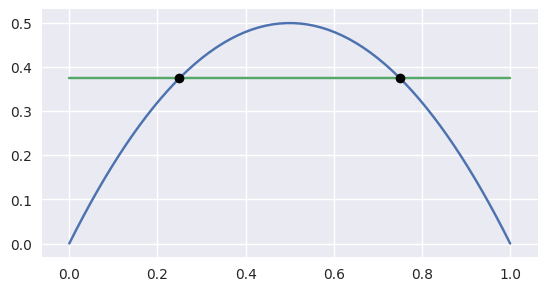

.. doctest:: intersect-1-9
   :options: +NORMALIZE_WHITESPACE

   >>> nodes1 = np.asfortranarray([
   ...     [0.0, 0.5, 1.0],
   ...     [0.0, 1.0, 0.0],
   ... ])
   >>> curve1 = bezier.Curve(nodes1, degree=2)
   >>> nodes2 = np.asfortranarray([
   ...     [0.5, 0.5 ],
   ...     [0.0, 0.75],
   ... ])
   >>> curve2 = bezier.Curve(nodes2, degree=1)
   >>> intersections = curve1.intersect(curve2)
   >>> intersections
   array([[0.5      ],
          [0.6666...]])
   >>> s_vals = np.asfortranarray(intersections[0, :])
   >>> curve1.evaluate_multi(s_vals)
   array([[0.5],
          [0.5]])

.. image:: images/curves1_and_9.png
   :align: center

.. doctest:: intersect-10-11
   :options: +NORMALIZE_WHITESPACE

   >>> nodes1 = np.asfortranarray([
   ...     [0.0, 4.5, 9.0],
   ...     [0.0, 9.0, 0.0],
   ... ])
   >>> curve1 = bezier.Curve(nodes1, degree=2)
   >>> nodes2 = np.asfortranarray([
   ...     [0.0, 6.0],
   ...     [8.0, 0.0],
   ... ])
   >>> curve2 = bezier.Curve(nodes2, degree=1)
   >>> intersections = curve1.intersect(curve2)
   >>> intersections
   array([[0.3333...],
          [0.5      ]])
   >>> s_vals = np.asfortranarray(intersections[0, :])
   >>> curve1.evaluate_multi(s_vals)
   array([[3.],
          [4.]])

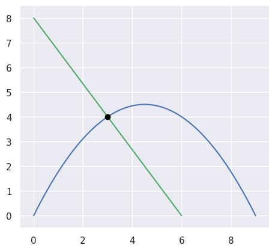

.. doctest:: intersect-8-9
   :options: +NORMALIZE_WHITESPACE

   >>> nodes1 = np.asfortranarray([
   ...     [0.0  , 1.0  ],
   ...     [0.375, 0.375],
   ... ])
   >>> curve1 = bezier.Curve(nodes1, degree=1)
   >>> nodes2 = np.asfortranarray([
   ...     [0.5, 0.5 ],
   ...     [0.0, 0.75],
   ... ])
   >>> curve2 = bezier.Curve(nodes2, degree=1)
   >>> intersections = curve1.intersect(curve2)
   >>> intersections
   array([[0.5],
          [0.5]])
   >>> s_vals = np.asfortranarray(intersections[0, :])
   >>> curve1.evaluate_multi(s_vals)
   array([[0.5  ],
          [0.375]])

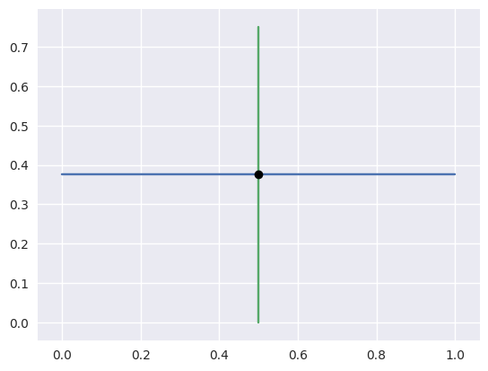

.. doctest:: intersect-29-30
   :options: +NORMALIZE_WHITESPACE

   >>> nodes1 = np.asfortranarray([
   ...     [-1.0, 0.5, 0.0],
   ...     [ 1.0, 0.5, 2.0],
   ... ])
   >>> curve1 = bezier.Curve(nodes1, degree=2)
   >>> nodes2 = np.asfortranarray([
   ...     [0.5, -0.25],
   ...     [0.5,  1.25],
   ... ])
   >>> curve2 = bezier.Curve(nodes2, degree=1)
   >>> intersections = curve1.intersect(curve2)
   >>> intersections
   array([[0.5      ],
          [0.6666...]])
   >>> s_vals = np.asfortranarray(intersections[0, :])
   >>> curve1.evaluate_multi(s_vals)
   array([[0.],
          [1.]])

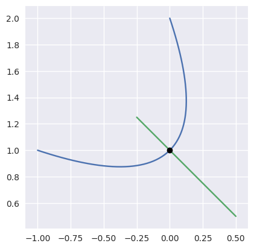

Curved Intersections
--------------------

For curves which intersect at **exact** floating point
numbers, we can typically compute the intersection
with zero error:

.. doctest:: intersect-1-5
   :options: +NORMALIZE_WHITESPACE

   >>> nodes1 = np.asfortranarray([
   ...     [0.0, 0.5, 1.0],
   ...     [0.0, 1.0, 0.0],
   ... ])
   >>> curve1 = bezier.Curve(nodes1, degree=2)
   >>> nodes2 = np.asfortranarray([
   ...     [0.0 ,  0.5 , 1.0 ],
   ...     [0.75, -0.25, 0.75],
   ... ])
   >>> curve2 = bezier.Curve(nodes2, degree=2)
   >>> intersections = curve1.intersect(curve2)
   >>> intersections
   array([[0.25, 0.75],
          [0.25, 0.75]])
   >>> s_vals = np.asfortranarray(intersections[0, :])
   >>> curve1.evaluate_multi(s_vals)
   array([[0.25 , 0.75 ],
          [0.375, 0.375]])

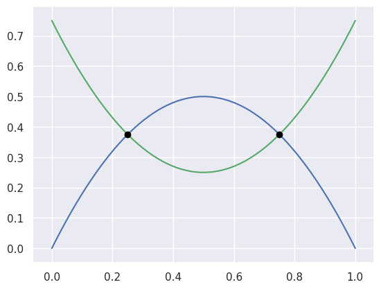

.. doctest:: intersect-3-4
   :options: +NORMALIZE_WHITESPACE

   >>> nodes1 = np.asfortranarray([
   ...     [0.0, 1.5, 3.0],
   ...     [0.0, 3.0, 0.0],
   ... ])
   >>> curve1 = bezier.Curve(nodes1, degree=2)
   >>> nodes2 = np.asfortranarray([
   ...     [3.0,  2.625  , -0.75  ],
   ...     [1.5, -0.90625,  2.4375],
   ... ])
   >>> curve2 = bezier.Curve(nodes2, degree=2)
   >>> intersections = curve1.intersect(curve2)
   >>> intersections
   array([[0.25 , 0.875],
          [0.75 , 0.25 ]])
   >>> s_vals = np.asfortranarray(intersections[0, :])
   >>> curve1.evaluate_multi(s_vals)
   array([[0.75   , 2.625  ],
          [1.125  , 0.65625]])

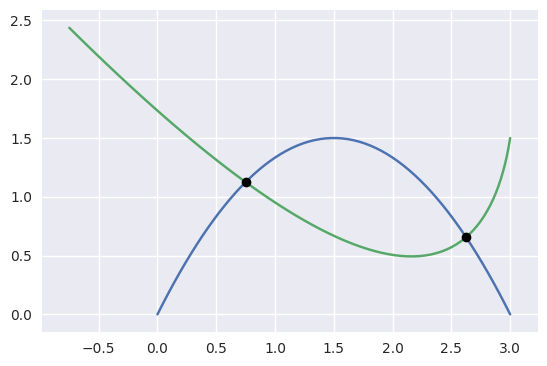

.. doctest:: intersect-14-16
   :options: +NORMALIZE_WHITESPACE

   >>> nodes1 = np.asfortranarray([
   ...     [0.0, 0.375, 0.75 ],
   ...     [0.0, 0.75 , 0.375],
   ... ])
   >>> curve1 = bezier.Curve(nodes1, degree=2)
   >>> nodes2 = np.asfortranarray([
   ...     [0.25  , 0.625 , 1.0   ],
   ...     [0.5625, 0.1875, 0.9375],
   ... ])
   >>> curve2 = bezier.Curve(nodes2, degree=2)
   >>> intersections = curve1.intersect(curve2)
   >>> intersections
   array([[0.5       , 0.8333...],
          [0.16666..., 0.5      ]])
   >>> s_vals = np.asfortranarray(intersections[0, :])
   >>> curve1.evaluate_multi(s_vals)
   array([[0.375  , 0.625  ],
          [0.46875, 0.46875]])

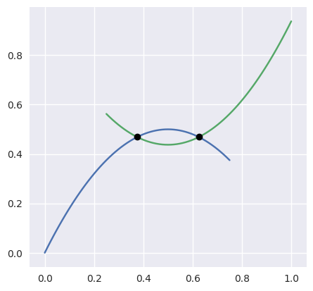

Even for curves which don't intersect at exact floating point
numbers, we can compute the intersection to machine precision:

.. doctest:: intersect-1-2
   :options: +NORMALIZE_WHITESPACE

   >>> nodes1 = np.asfortranarray([
   ...     [0.0, 0.5, 1.0],
   ...     [0.0, 1.0, 0.0],
   ... ])
   >>> curve1 = bezier.Curve(nodes1, degree=2)
   >>> nodes2 = np.asfortranarray([
   ...     [1.125,  0.625, 0.125],
   ...     [0.5  , -0.5  , 0.5  ],
   ... ])
   >>> curve2 = bezier.Curve(nodes2, degree=2)
   >>> intersections = curve1.intersect(curve2)
   >>> sq31 = np.sqrt(31.0)
   >>> expected_ints = np.asfortranarray([
   ...     [9 - sq31, 9 + sq31],
   ...     [9 + sq31, 9 - sq31],
   ... ]) / 16.0
   >>> max_err = np.max(np.abs(intersections - expected_ints))
   >>> binary_exponent(max_err) <= -53
   True
   >>> s_vals = np.asfortranarray(intersections[0, :])
   >>> points = curve1.evaluate_multi(s_vals)
   >>> expected_pts = np.asfortranarray([
   ...     [36 - 4 * sq31, 36 + 4 * sq31],
   ...     [    16 + sq31, 16 - sq31    ],
   ... ]) / 64.0
   >>> max_err = np.max(np.abs(points - expected_pts))
   >>> binary_exponent(max_err)
   -54

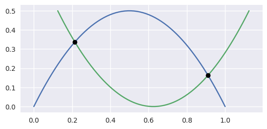

.. doctest:: intersect-1-7
   :options: +NORMALIZE_WHITESPACE

   >>> nodes1 = np.asfortranarray([
   ...     [0.0, 0.5, 1.0],
   ...     [0.0, 1.0, 0.0],
   ... ])
   >>> curve1 = bezier.Curve(nodes1, degree=2)
   >>> nodes2 = np.asfortranarray([
   ...     [0.0     , 0.5     , 1.0     ],
   ...     [0.265625, 0.234375, 0.265625],
   ... ])
   >>> curve2 = bezier.Curve(nodes2, degree=2)
   >>> intersections = curve1.intersect(curve2)
   >>> sq33 = np.sqrt(33.0)
   >>> expected_ints = np.asfortranarray([
   ...     [33 - 4 * sq33, 33 + 4 * sq33],
   ...     [33 - 4 * sq33, 33 + 4 * sq33],
   ... ]) / 66.0
   >>> max_err = np.max(np.abs(intersections - expected_ints))
   >>> binary_exponent(max_err)
   -54
   >>> s_vals = np.asfortranarray(intersections[0, :])
   >>> points = curve1.evaluate_multi(s_vals)
   >>> expected_pts = np.asfortranarray([
   ...     [33 - 4 * sq33, 33 + 4 * sq33],
   ...     [           17, 17           ],
   ... ]) / 66.0
   >>> max_err = np.max(np.abs(points - expected_pts))
   >>> binary_exponent(max_err)
   -54

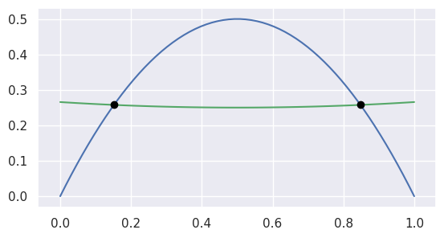

.. doctest:: intersect-1-13
   :options: +NORMALIZE_WHITESPACE

   >>> nodes1 = np.asfortranarray([
   ...     [0.0, 0.5, 1.0],
   ...     [0.0, 1.0, 0.0],
   ... ])
   >>> curve1 = bezier.Curve(nodes1, degree=2)
   >>> nodes2 = np.asfortranarray([
   ...     [0.0, 0.25,  0.5, 0.75, 1.0],
   ...     [0.0, 2.0 , -2.0, 2.0 , 0.0],
   ... ])
   >>> curve2 = bezier.Curve(nodes2, degree=4)
   >>> intersections = curve1.intersect(curve2)
   >>> s_vals = np.asfortranarray(intersections[0, :])
   >>> points = curve1.evaluate_multi(s_vals)
   >>> sq7 = np.sqrt(7.0)
   >>> expected_ints = np.asfortranarray([
   ...     [7 - sq7, 7 + sq7, 0, 14],
   ...     [7 - sq7, 7 + sq7, 0, 14],
   ... ]) / 14.0
   >>> max_err = np.max(np.abs(intersections - expected_ints))
   >>> binary_exponent(max_err) <= -53
   True
   >>> expected_pts = np.asfortranarray([
   ...     [7 - sq7, 7 + sq7, 0, 14],
   ...     [      6,       6, 0, 0 ],
   ... ]) / 14.0
   >>> max_err = np.max(np.abs(points - expected_pts))
   >>> binary_exponent(max_err) <= -53
   True

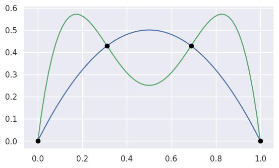

.. doctest:: intersect-21-22
   :options: +NORMALIZE_WHITESPACE

   >>> nodes1 = np.asfortranarray([
   ...     [-0.125  , 0.5    ,  1.125  ],
   ...     [-0.28125, 1.28125, -0.28125],
   ... ])
   >>> curve1 = bezier.Curve(nodes1, degree=2)
   >>> nodes2 = np.asfortranarray([
   ...     [ 1.5625, -1.5625, 1.5625],
   ...     [-0.0625,  0.25  , 0.5625],
   ... ])
   >>> curve2 = bezier.Curve(nodes2, degree=2)
   >>> intersections = curve1.intersect(curve2)
   >>> sq5 = np.sqrt(5.0)
   >>> expected_ints = np.asfortranarray([
   ...     [4 - sq5, 3, 9, 4 + sq5],
   ...     [6 - sq5, 7, 1, 6 + sq5],
   ... ]) / 10.0
   >>> max_err = np.max(np.abs(intersections - expected_ints))
   >>> binary_exponent(max_err) <= -51
   True
   >>> s_vals = np.asfortranarray(intersections[0, :])
   >>> points = curve1.evaluate_multi(s_vals)
   >>> expected_pts = np.asfortranarray([
   ...     [6 - 2 * sq5, 4, 16, 6 + 2 * sq5],
   ...     [    5 - sq5, 6,  0, 5 + sq5    ],
   ... ]) / 16.0
   >>> max_err = np.max(np.abs(points - expected_pts))
   >>> binary_exponent(max_err)
   -53

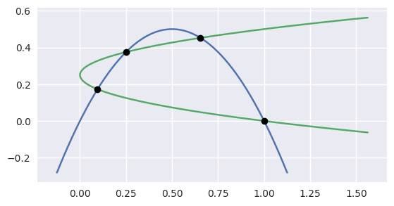

For higher degree intersections, the error starts to get a little
larger.

.. doctest:: intersect-15-25
   :options: +NORMALIZE_WHITESPACE

   >>> nodes1 = np.asfortranarray([
   ...     [0.25 , 0.625, 1.0],
   ...     [0.625, 0.25 , 1.0],
   ... ])
   >>> curve1 = bezier.Curve(nodes1, degree=2)
   >>> nodes2 = np.asfortranarray([
   ...     [0.0, 0.25, 0.75, 1.0],
   ...     [0.5, 1.0 , 1.5 , 0.5],
   ... ])
   >>> curve2 = bezier.Curve(nodes2, degree=3)
   >>> intersections = curve1.intersect(curve2)
   >>> s_vals = np.roots([486, -3726, 13905, -18405, 6213, 1231])
   >>> _, s_val, _ = np.sort(s_vals[s_vals.imag == 0].real)
   >>> t_vals = np.roots([4, -16, 13, 25, -28, 4])
   >>> _, _, t_val = np.sort(t_vals[t_vals.imag == 0].real)
   >>> expected_ints = np.asfortranarray([
   ...     [s_val],
   ...     [t_val],
   ... ])
   >>> max_err = np.max(np.abs(intersections - expected_ints))
   >>> binary_exponent(max_err)
   -50
   >>> s_vals = np.asfortranarray(intersections[0, :])
   >>> points = curve1.evaluate_multi(s_vals)
   >>> x_val = (3 * s_val + 1) / 4
   >>> y_val = (9 * s_val * s_val - 6 * s_val + 5) / 8
   >>> expected_pts = np.asfortranarray([
   ...     [x_val],
   ...     [y_val],
   ... ])
   >>> max_err = np.max(np.abs(points - expected_pts))
   >>> binary_exponent(max_err) <= -50
   True

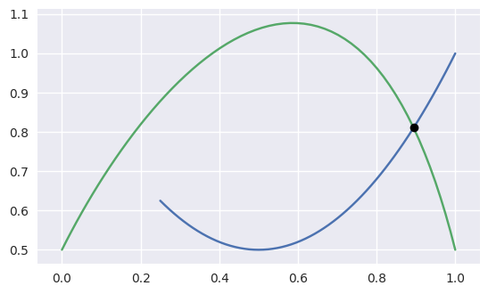

.. doctest:: intersect-11-26
   :options: +NORMALIZE_WHITESPACE

   >>> nodes1 = np.asfortranarray([
   ...     [0.0, 6.0],
   ...     [8.0, 0.0],
   ... ])
   >>> curve1 = bezier.Curve(nodes1, degree=1)
   >>> nodes2 = np.asfortranarray([
   ...     [0.375, 2.125, 3.875, 5.625],
   ...     [7.0  , 8.0  , 0.0  , 1.0  ],
   ... ])
   >>> curve2 = bezier.Curve(nodes2, degree=3)
   >>> intersections = curve1.intersect(curve2)
   >>> sq7 = np.sqrt(7.0)
   >>> expected_ints = np.asfortranarray([
   ...     [24, 24 - 7 * sq7, 24 + 7 * sq7],
   ...     [24, 24 - 8 * sq7, 24 + 8 * sq7],
   ... ]) / 48.0
   >>> max_err = np.max(np.abs(intersections - expected_ints))
   >>> binary_exponent(max_err)
   -52
   >>> s_vals = np.asfortranarray(intersections[0, :])
   >>> points = curve1.evaluate_multi(s_vals)
   >>> expected_pts = np.asfortranarray([
   ...     [72, 72 - 21 * sq7, 72 + 21 * sq7],
   ...     [96, 96 + 28 * sq7, 96 - 28 * sq7],
   ... ]) / 24.0
   >>> max_err = np.max(np.abs(points - expected_pts))
   >>> binary_exponent(max_err)
   -50

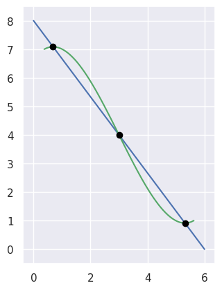

.. doctest:: intersect-8-27
   :options: +NORMALIZE_WHITESPACE

   >>> nodes1 = np.asfortranarray([
   ...     [0.0  , 1.0  ],
   ...     [0.375, 0.375],
   ... ])
   >>> curve1 = bezier.Curve(nodes1, degree=1)
   >>> nodes2 = np.asfortranarray([
   ...     [0.125, 0.375, 0.625, 0.875 ],
   ...     [0.25 , 0.75 , 0.0  , 0.1875],
   ... ])
   >>> curve2 = bezier.Curve(nodes2, degree=3)
   >>> intersections = curve1.intersect(curve2)
   >>> s_vals = np.asfortranarray(intersections[0, :])
   >>> points = curve1.evaluate_multi(s_vals)
   >>> s_val2, s_val1, _ = np.sort(np.roots(
   ...     [17920, -29760, 13512, -1691]))
   >>> t_val2, t_val1, _ = np.sort(np.roots([35, -60, 24, -2]))
   >>> expected_ints = np.asfortranarray([
   ...     [s_val1, s_val2],
   ...     [t_val1, t_val2],
   ... ])
   >>> max_err = np.max(np.abs(intersections - expected_ints))
   >>> binary_exponent(max_err)
   -52
   >>> expected_pts = np.asfortranarray([
   ...     [s_val1, s_val2],
   ...     [ 0.375, 0.375 ],
   ... ])
   >>> max_err = np.max(np.abs(points - expected_pts))
   >>> binary_exponent(max_err)
   -52

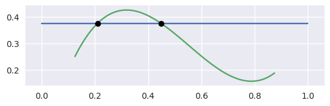

Intersections at Endpoints
--------------------------

.. doctest:: intersect-1-18
   :options: +NORMALIZE_WHITESPACE

   >>> nodes1 = np.asfortranarray([
   ...     [0.0, 0.5, 1.0],
   ...     [0.0, 1.0, 0.0],
   ... ])
   >>> curve1 = bezier.Curve(nodes1, degree=2)
   >>> nodes2 = np.asfortranarray([
   ...     [1.0,  1.5, 2.0],
   ...     [0.0, -1.0, 0.0],
   ... ])
   >>> curve2 = bezier.Curve(nodes2, degree=2)
   >>> intersections = curve1.intersect(curve2)
   >>> intersections
   array([[1.],
          [0.]])
   >>> s_vals = np.asfortranarray(intersections[0, :])
   >>> curve1.evaluate_multi(s_vals)
   array([[1.],
          [0.]])

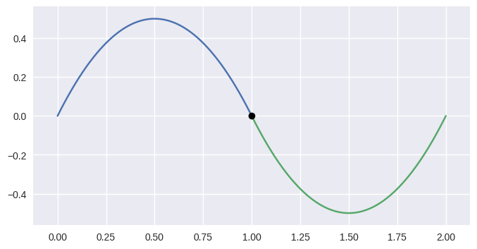

.. doctest:: intersect-1-19
   :options: +NORMALIZE_WHITESPACE

   >>> nodes1 = np.asfortranarray([
   ...     [0.0, 0.5, 1.0],
   ...     [0.0, 1.0, 0.0],
   ... ])
   >>> curve1 = bezier.Curve(nodes1, degree=2)
   >>> nodes2 = np.asfortranarray([
   ...     [2.0, 1.5, 1.0],
   ...     [0.0, 1.0, 0.0],
   ... ])
   >>> curve2 = bezier.Curve(nodes2, degree=2)
   >>> intersections = curve1.intersect(curve2)
   >>> intersections
   array([[1.],
          [1.]])
   >>> s_vals = np.asfortranarray(intersections[0, :])
   >>> curve1.evaluate_multi(s_vals)
   array([[1.],
          [0.]])

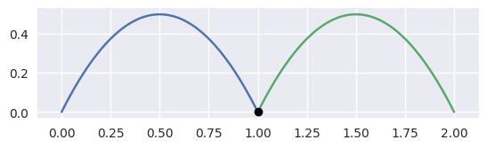

.. doctest:: intersect-10-17
   :options: +NORMALIZE_WHITESPACE

   >>> nodes1 = np.asfortranarray([
   ...     [0.0, 4.5, 9.0],
   ...     [0.0, 9.0, 0.0],
   ... ])
   >>> curve1 = bezier.Curve(nodes1, degree=2)
   >>> nodes2 = np.asfortranarray([
   ...     [11.0,  7.0, 3.0],
   ...     [ 8.0, 10.0, 4.0],
   ... ])
   >>> curve2 = bezier.Curve(nodes2, degree=2)
   >>> intersections = curve1.intersect(curve2)
   >>> intersections
   array([[0.333...],
          [1.      ]])
   >>> s_vals = np.asfortranarray(intersections[0, :])
   >>> curve1.evaluate_multi(s_vals)
   array([[3.],
          [4.]])

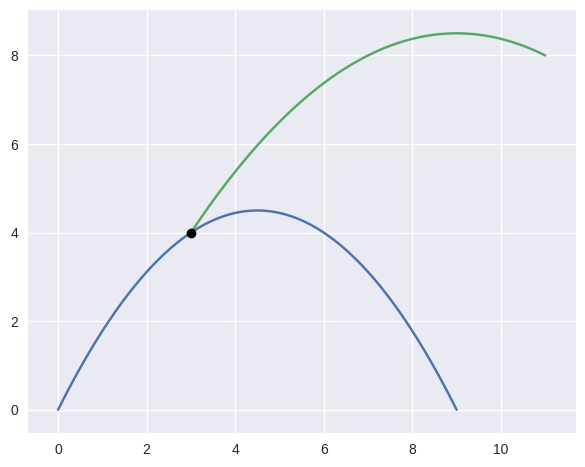

Detecting Self-Intersections
----------------------------

.. doctest:: intersect-12-self
   :options: +NORMALIZE_WHITESPACE

   >>> nodes = np.asfortranarray([
   ...     [0.0, -1.0, 1.0, -0.75 ],
   ...     [2.0,  0.0, 1.0,  1.625],
   ... ])
   >>> curve = bezier.Curve(nodes, degree=3)
   >>> left, right = curve.subdivide()
   >>> intersections = left.intersect(right)
   >>> sq5 = np.sqrt(5.0)
   >>> expected_ints = np.asfortranarray([
   ...     [3, 3 - sq5],
   ...     [0, sq5    ],
   ... ]) / 3.0
   >>> max_err = np.max(np.abs(intersections - expected_ints))
   >>> binary_exponent(max_err)
   -53
   >>> s_vals = np.asfortranarray(intersections[0, :])
   >>> left.evaluate_multi(s_vals)
   array([[-0.09375 , -0.25  ],
          [ 0.828125,  1.375 ]])

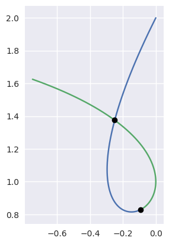

Limitations
-----------

Intersections that occur at points of tangency are in
general problematic. For example, consider

.. math::

   B_1(s) = \left[ \begin{array}{c} s \\ 2s(1 - s)\end{array}\right],
       \quad B_2(t) = \left[ \begin{array}{c}
       t \\ t^2 + (1 - t)^2 \end{array}\right]

The first curve is the zero set of :math:`y - 2x(1 - x)`, so plugging
in the second curve gives

.. math::

   0 = t^2 + (1 - t)^2 - 2t(1 - t) = (2t - 1)^2.

This shows that a point of tangency is equivalent to a repeated
root of a polynomial. For this example, the intersection process
successfully terminates

.. doctest:: intersect-1-6
   :options: +NORMALIZE_WHITESPACE

   >>> nodes1 = np.asfortranarray([
   ...     [0.0, 0.5, 1.0],
   ...     [0.0, 1.0, 0.0],
   ... ])
   >>> curve1 = bezier.Curve(nodes1, degree=2)
   >>> nodes2 = np.asfortranarray([
   ...     [0.0, 0.5, 1.0],
   ...     [1.0, 0.0, 1.0],
   ... ])
   >>> curve2 = bezier.Curve(nodes2, degree=2)
   >>> intersections = curve1.intersect(curve2)
   >>> intersections
   array([[0.5],
          [0.5]])
   >>> s_vals = np.asfortranarray(intersections[0, :])
   >>> curve1.evaluate_multi(s_vals)
   array([[0.5],
          [0.5]])

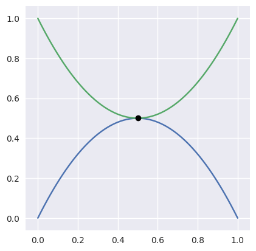

This library makes an earnest effort to compute tangent intersections.
For example, when the curves

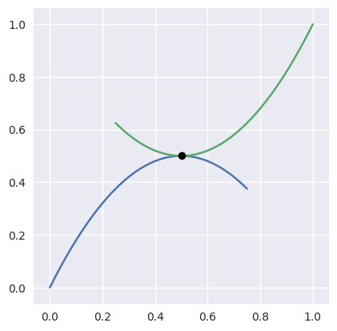

have been subdivided and approximated by lines, the corresponding
segments are parallel, hence don't intersect. At this point, this library
detects the problematic intersection point and switches to a more robust
Newton's method that is built to handle the numerical issue caused by
the double root.

Unlike the first tangent example, this intersection occurs at parameters
which are not **exact** floating point numbers:

.. doctest:: intersect-14-15
   :options: +NORMALIZE_WHITESPACE

   >>> nodes1 = np.asfortranarray([
   ...     [0.0, 0.375, 0.75 ],
   ...     [0.0, 0.75 , 0.375],
   ... ])
   >>> curve1 = bezier.Curve(nodes1, degree=2)
   >>> nodes2 = np.asfortranarray([
   ...     [0.25 , 0.625, 1.0],
   ...     [0.625, 0.25 , 1.0],
   ... ])
   >>> curve2 = bezier.Curve(nodes2, degree=2)
   >>> intersections = curve1.intersect(curve2)
   >>> intersections
   array([[0.6666...],
          [0.3333...]])
   >>> s_vals = np.asfortranarray(intersections[0, :])
   >>> curve1.evaluate_multi(s_vals)
   array([[0.5],
          [0.5]])

See another case where one parameter is an exact floating point
number and the other is not:

.. doctest:: intersect-10-23
   :options: +NORMALIZE_WHITESPACE

   >>> nodes1 = np.asfortranarray([
   ...     [0.0, 4.5, 9.0],
   ...     [0.0, 9.0, 0.0],
   ... ])
   >>> curve1 = bezier.Curve(nodes1, degree=2)
   >>> nodes2 = np.asfortranarray([
   ...     [3.0, 8.0],
   ...     [4.5, 4.5],
   ... ])
   >>> curve2 = bezier.Curve(nodes2, degree=1)
   >>> intersections = curve1.intersect(curve2)
   >>> intersections
   array([[0.5],
          [0.3]])
   >>> s_vals = np.asfortranarray(intersections[0, :])
   >>> curve1.evaluate_multi(s_vals)
   array([[4.5],
          [4.5]])

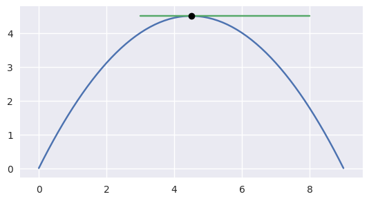

In addition to points of tangency, **coincident curve segments**
are partially supported (but are in general hard to detect). For the
curves

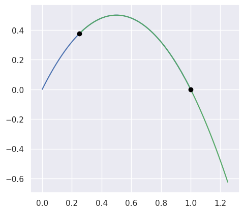

the library determines the "intersection" points as the beginning
and end of the segment that is common to both curves:

.. doctest:: intersect-1-24
   :options: +NORMALIZE_WHITESPACE

   >>> nodes1 = np.asfortranarray([
   ...     [0.0, 0.5, 1.0],
   ...     [0.0, 1.0, 0.0],
   ... ])
   >>> curve1 = bezier.Curve(nodes1, degree=2)
   >>> nodes2 = np.asfortranarray([
   ...     [0.25, 0.75, 1.25],
   ...     [0.375, 0.875, -0.625],
   ... ])
   >>> curve2 = bezier.Curve(nodes2, degree=2)
   >>> curve1.intersect(curve2)
   array([[0.25, 1.  ],
          [0.  , 0.75]])
