Curve-Curve Intersection
========================

.. testsetup:: *

   import bezier
   import numpy as np

The problem of intersecting two curves is a difficult one
in computational geometry. The :meth:`.Curve.intersect`
method uses a combination of curve subdivision, bounding
box intersection, and curve approximation (by lines) to
find intersections.

Curve-Line Intersection
-----------------------

.. doctest:: intersect-1-8
   :options: +NORMALIZE_WHITESPACE

   >>> curve1 = bezier.Curve(np.array([
   ...     [0.0, 0.0],
   ...     [0.5, 1.0],
   ...     [1.0, 0.0],
   ... ]))
   >>> curve2 = bezier.Curve(np.array([
   ...     [0.0, 0.375],
   ...     [1.0, 0.375],
   ... ]))
   >>> curve1.intersect(curve2)
   array([[ 0.25 , 0.375],
          [ 0.75 , 0.375]])

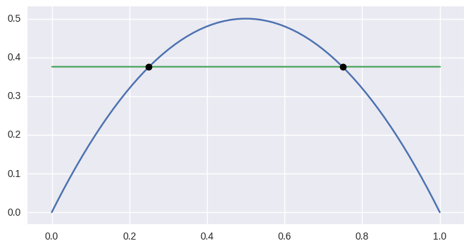

.. doctest:: intersect-1-9
   :options: +NORMALIZE_WHITESPACE

   >>> curve1 = bezier.Curve(np.array([
   ...     [0.0, 0.0],
   ...     [0.5, 1.0],
   ...     [1.0, 0.0],
   ... ]))
   >>> curve2 = bezier.Curve(np.array([
   ...     [0.5, 0.0 ],
   ...     [0.5, 0.75],
   ... ]))
   >>> curve1.intersect(curve2)
   array([[ 0.5, 0.5]])

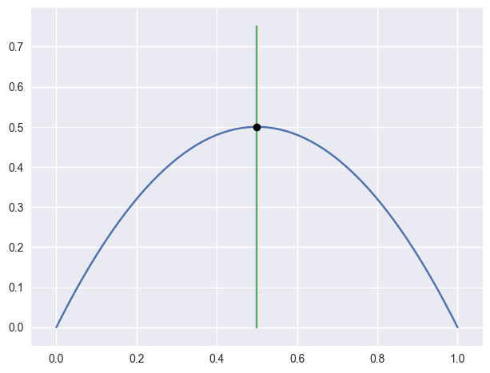

.. doctest:: intersect-10-11
   :options: +NORMALIZE_WHITESPACE

   >>> curve1 = bezier.Curve(np.array([
   ...     [0.0, 0.0],
   ...     [4.5, 9.0],
   ...     [9.0, 0.0],
   ... ]))
   >>> curve2 = bezier.Curve(np.array([
   ...     [0.0, 8.0],
   ...     [6.0, 0.0],
   ... ]))
   >>> curve1.intersect(curve2)
   array([[ 3., 4.]])

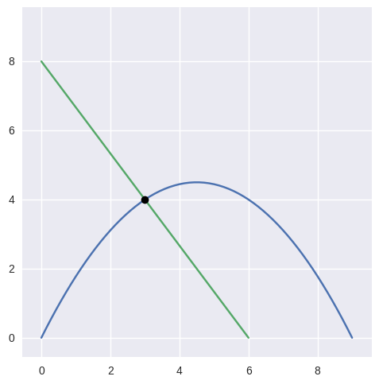

.. doctest:: intersect-8-9
   :options: +NORMALIZE_WHITESPACE

   >>> curve1 = bezier.Curve(np.array([
   ...     [0.0, 0.375],
   ...     [1.0, 0.375],
   ... ]))
   >>> curve2 = bezier.Curve(np.array([
   ...     [0.5, 0.0 ],
   ...     [0.5, 0.75],
   ... ]))
   >>> curve1.intersect(curve2)
   array([[ 0.5 , 0.375]])

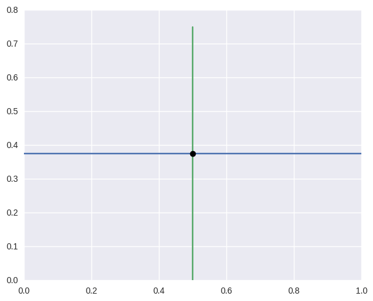

Curved Intersections
--------------------

For curves which intersect at **exact** floating point
numbers, we can typically compute the intersection
with zero error:

.. doctest:: intersect-1-5
   :options: +NORMALIZE_WHITESPACE

   >>> curve1 = bezier.Curve(np.array([
   ...     [0.0, 0.0],
   ...     [0.5, 1.0],
   ...     [1.0, 0.0],
   ... ]))
   >>> curve2 = bezier.Curve(np.array([
   ...     [0.0,  0.75],
   ...     [0.5, -0.25],
   ...     [1.0,  0.75],
   ... ]))
   >>> curve1.intersect(curve2)
   array([[ 0.25 , 0.375],
          [ 0.75 , 0.375]])

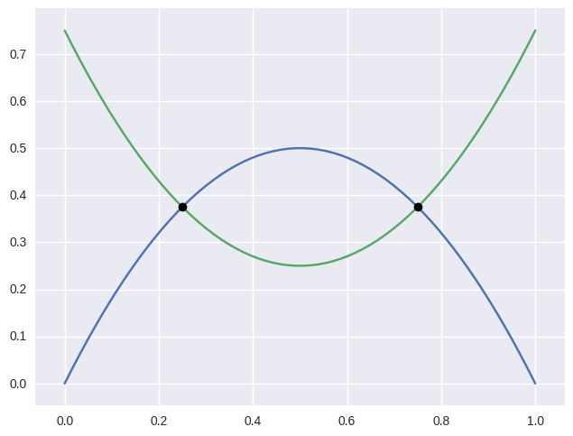

.. doctest:: intersect-3-4
   :options: +NORMALIZE_WHITESPACE

   >>> curve1 = bezier.Curve(np.array([
   ...     [0.0, 0.0],
   ...     [1.5, 3.0],
   ...     [3.0, 0.0],
   ... ]))
   >>> curve2 = bezier.Curve(np.array([
   ...     [ 3.0  ,  1.5    ],
   ...     [ 2.625, -0.90625],
   ...     [-0.75 ,  2.4375 ],
   ... ]))
   >>> curve1.intersect(curve2)
   array([[ 0.75  , 1.125  ],
          [ 2.625 , 0.65625]])

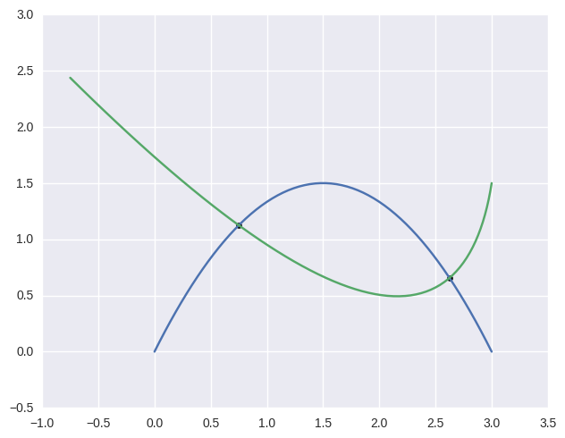

.. doctest:: intersect-14-16
   :options: +NORMALIZE_WHITESPACE

   >>> curve1 = bezier.Curve(np.array([
   ...     [0.0  , 0.0  ],
   ...     [0.375, 0.75 ],
   ...     [0.75 , 0.375],
   ... ]))
   >>> curve2 = bezier.Curve(np.array([
   ...     [0.25 , 0.5625],
   ...     [0.625, 0.1875],
   ...     [1.0  , 0.9375],
   ... ]))
   >>> curve1.intersect(curve2)
   array([[ 0.375 , 0.46875],
          [ 0.625 , 0.46875]])

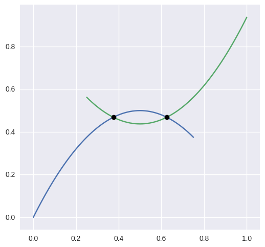

Even for curves which don't intersect at exact floating point
numbers, we can compute the intersection to machine precision:

.. doctest:: intersect-1-2
   :options: +ELLIPSIS, +NORMALIZE_WHITESPACE

   >>> curve1 = bezier.Curve(np.array([
   ...     [0.0, 0.0],
   ...     [0.5, 1.0],
   ...     [1.0, 0.0],
   ... ]))
   >>> curve2 = bezier.Curve(np.array([
   ...     [1.125,  0.5],
   ...     [0.625, -0.5],
   ...     [0.125,  0.5],
   ... ]))
   >>> curve1.intersect(curve2)
   array([[ 0.214514..., 0.336996...],
          [ 0.910485..., 0.163003...]])

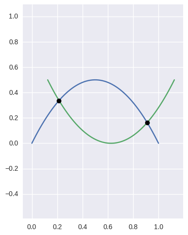

.. doctest:: intersect-1-7
   :options: +ELLIPSIS, +NORMALIZE_WHITESPACE

   >>> curve1 = bezier.Curve(np.array([
   ...     [0.0, 0.0],
   ...     [0.5, 1.0],
   ...     [1.0, 0.0],
   ... ]))
   >>> curve2 = bezier.Curve(np.array([
   ...     [0.0, 0.265625],
   ...     [0.5, 0.234375],
   ...     [1.0, 0.265625],
   ... ]))
   >>> curve1.intersect(curve2)
   array([[ 0.151844...,  0.257575...],
          [ 0.848155...,  0.257575...]])

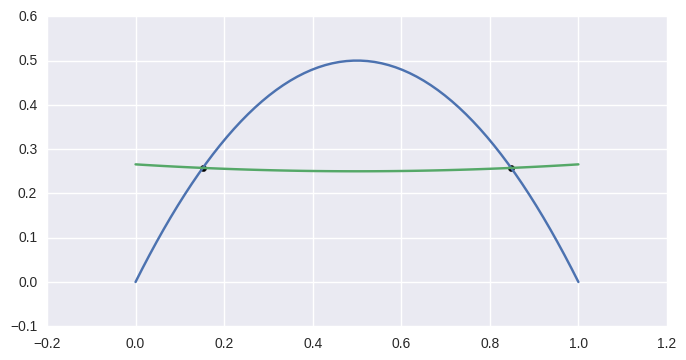

.. doctest:: intersect-1-13
   :options: +ELLIPSIS, +NORMALIZE_WHITESPACE

   >>> curve1 = bezier.Curve(np.array([
   ...     [0.0, 0.0],
   ...     [0.5, 1.0],
   ...     [1.0, 0.0],
   ... ]))
   >>> curve2 = bezier.Curve(np.array([
   ...     [0.0 ,  0.0],
   ...     [0.25,  2.0],
   ...     [0.5 , -2.0],
   ...     [0.75,  2.0],
   ...     [1.0 ,  0.0],
   ... ]))
   >>> curve1.intersect(curve2)
   array([[ 0.311017...,  0.428571...],
          [ 0.688982...,  0.428571...],
          [ 0.         ,  0.         ],
          [ 1.         ,  0.         ]])

.. image:: images/test_curves1_and_13.png
   :align: center

.. doctest:: intersect-21-22
   :options: +NORMALIZE_WHITESPACE

   >>> curve1 = bezier.Curve(np.array([
   ...     [-0.125, -0.28125],
   ...     [ 0.5  ,  1.28125],
   ...     [ 1.125, -0.28125],
   ... ]))
   >>> curve2 = bezier.Curve(np.array([
   ...     [ 1.5625, -0.0625],
   ...     [-1.5625,  0.25  ],
   ...     [ 1.5625,  0.5625],
   ... ]))
   >>> curve1.intersect(curve2)
   array([[  9.54915028e-02,  1.72745751e-01],
          [  2.50000000e-01,  3.75000000e-01],
          [  1.00000000e+00, -5.55111512e-17],
          [  6.54508497e-01,  4.52254249e-01]])

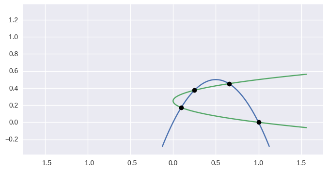

Intersections at Endpoints
--------------------------

.. doctest:: intersect-1-18
   :options: +NORMALIZE_WHITESPACE

   >>> curve1 = bezier.Curve(np.array([
   ...     [0.0, 0.0],
   ...     [0.5, 1.0],
   ...     [1.0, 0.0],
   ... ]))
   >>> curve2 = bezier.Curve(np.array([
   ...     [1.0,  0.0],
   ...     [1.5, -1.0],
   ...     [2.0,  0.0],
   ... ]))
   >>> curve1.intersect(curve2)
   array([[ 1., 0.]])

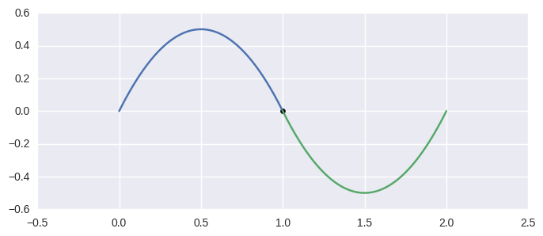

.. doctest:: intersect-1-19
   :options: +NORMALIZE_WHITESPACE

   >>> curve1 = bezier.Curve(np.array([
   ...     [0.0, 0.0],
   ...     [0.5, 1.0],
   ...     [1.0, 0.0],
   ... ]))
   >>> curve2 = bezier.Curve(np.array([
   ...     [2.0, 0.0],
   ...     [1.5, 1.0],
   ...     [1.0, 0.0],
   ... ]))
   >>> curve1.intersect(curve2)
   array([[ 1., 0.]])

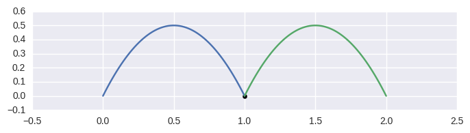

.. doctest:: intersect-10-17
   :options: +NORMALIZE_WHITESPACE

   >>> curve1 = bezier.Curve(np.array([
   ...     [0.0, 0.0],
   ...     [4.5, 9.0],
   ...     [9.0, 0.0],
   ... ]))
   >>> curve2 = bezier.Curve(np.array([
   ...     [11.0,  8.0],
   ...     [ 7.0, 10.0],
   ...     [ 3.0,  4.0],
   ... ]))
   >>> curve1.intersect(curve2)
   array([[ 3., 4.]])

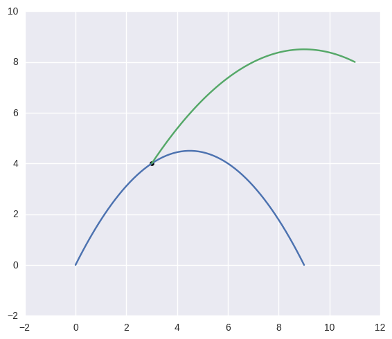

Detecting Self-Intersections
----------------------------

.. doctest:: intersect-12-self
   :options: +NORMALIZE_WHITESPACE

   >>> curve1 = bezier.Curve(np.array([
   ...     [ 0.0 , 0.0  ],
   ...     [-1.0 , 0.0  ],
   ...     [ 1.0 , 1.0  ],
   ...     [-0.75, 1.625],
   ... ]))
   >>> left, right = curve1.subdivide()
   >>> left.intersect(right)
   array([[-0.09375 , 0.578125]])

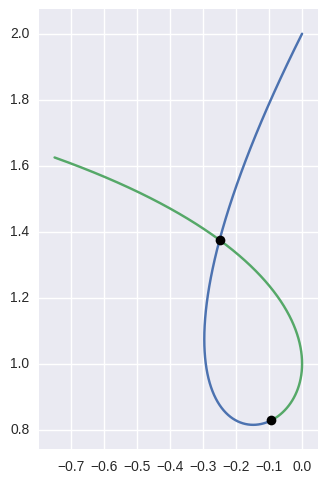

Limitations
-----------

Intersections that occur at points of tangency are in
general problematic. For example, consider

.. math::

   B_1(s) = \left[ \begin{array}{c} s \\ 2s(1 - s)\end{array}\right],
       \quad B_2(t) = \left[ \begin{array}{c}
       t \\ t^2 + (1 - t)^2 \end{array}\right]

The first curve is the zero set of :math:`y - 2x(1 - x)`, so plugging
in the second curve gives

.. math::

   0 = t^2 + (1 - t)^2 - 2t(1 - t) = (2t - 1)^2.

This shows that a point of tangency is equivalent to a repeated
root of a polynomial. For this example, the intersection process
successfully terminates

.. doctest:: intersect-1-6
   :options: +NORMALIZE_WHITESPACE

   >>> curve1 = bezier.Curve(np.array([
   ...     [0.0, 0.0],
   ...     [0.5, 1.0],
   ...     [1.0, 0.0],
   ... ]))
   >>> curve2 = bezier.Curve(np.array([
   ...     [0.0, 1.0],
   ...     [0.5, 0.0],
   ...     [1.0, 1.0],
   ... ]))
   >>> curve1.intersect(curve2)
   array([[ 0.5, 0.5]])

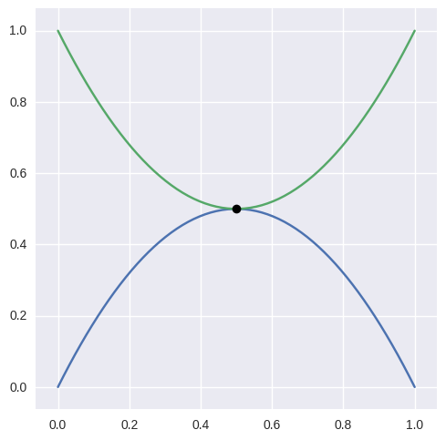

However this library mostly avoids (for now) computing tangent
intersections. For example, the curves

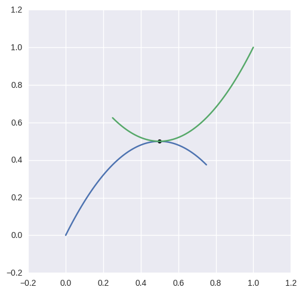

have a tangent intersection that this library fails to
compute:

.. doctest:: intersect-14-15
   :options: +NORMALIZE_WHITESPACE

   >>> curve1 = bezier.Curve(np.array([
   ...     [0.0  , 0.0  ],
   ...     [0.375, 0.75 ],
   ...     [0.75 , 0.375],
   ... ]))
   >>> curve2 = bezier.Curve(np.array([
   ...     [0.25 , 0.625],
   ...     [0.625, 0.25 ],
   ...     [1.0  , 1.0  ],
   ... ]))
   >>> curve1.intersect(curve2)
   Traceback (most recent call last):
     ...
   NotImplementedError: Delta_0 x Delta_1 = 0 not supported

This failure comes from the fact that the linear approximations
of the curves near the point of intersection are parallel.

As above, we can find some cases where tangent intersections
are resolved:

.. doctest:: intersect-10-23
   :options: +NORMALIZE_WHITESPACE

   >>> curve1 = bezier.Curve(np.array([
   ...     [0.0, 0.0],
   ...     [4.5, 9.0],
   ...     [9.0, 0.0],
   ... ]))
   >>> curve2 = bezier.Curve(np.array([
   ...     [3.0, 4.5],
   ...     [8.0, 4.5],
   ... ]))
   >>> curve1.intersect(curve2)
   array([[ 4.5, 4.5]])

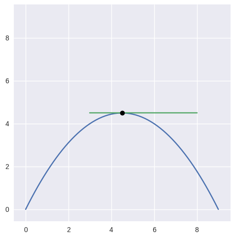

In addition to points of tangency, coincident curve segments
are (for now) not supported. For the curves

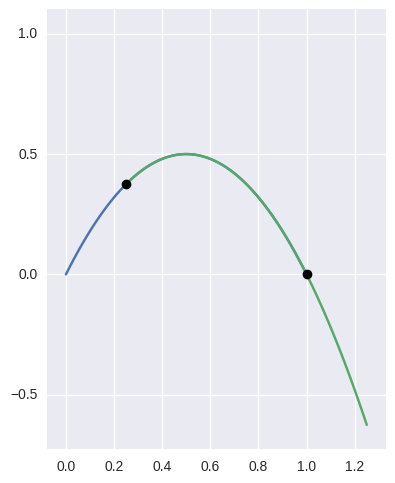

the library fails as well

.. doctest:: intersect-1-24
   :options: +NORMALIZE_WHITESPACE

   >>> curve1 = bezier.Curve(np.array([
   ...     [0.0, 0.0],
   ...     [0.5, 1.0],
   ...     [1.0, 0.0],
   ... ]))
   >>> curve2 = bezier.Curve(np.array([
   ...     [0.25,  0.375],
   ...     [0.75,  0.875],
   ...     [1.25, -0.625],
   ... ]))
   >>> curve1.intersect(curve2)
   Traceback (most recent call last):
     ...
   NotImplementedError: The number of candidate intersections is too high.
