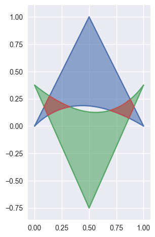

``bezier``
==========

    Helper for B |eacute| zier Curves, Triangles, and Higher Order Objects

.. toctree::
   :hidden:
   :maxdepth: 4

   Bezier Package <reference/bezier>
   curve-curve-intersection
   algorithm-helpers
   development

This library provides:

* Support for B |eacute| zier :mod:`Curves <bezier.curve>`
* Support for B |eacute| zier :mod:`Surfaces <bezier.surface>`

Dive in and take a look!

.. |eacute| unicode:: U+000E9 .. LATIN SMALL LETTER E WITH ACUTE
   :trim:

Why B |eacute| zier?
--------------------

A B |eacute| zier curves (and surface, etc.) is a parametric curve
that uses the `Bernstein basis`_:

.. math::

   b_{j, n} = \binom{n}{j} s^j (1 - s)^{n - j}

to define a curve as a linear combination:

.. math::

   B(s) = \sum_{j = 0}^n b_{j, n} \cdot v_j.

This comes from the fact that the weights sum to one:

.. math::

   b_{0, n} + b_{1, n} + \cdots + b_{n, n} =
       \left(s + (1 - s)\right)^n = 1.

This can be generalized to higher order by considering three, four, etc.
non-negative weights that sum to one (in the above we have the two
non-negative weights :math:`s` and :math:`1 - s`).

Due to their simple form, B |eacute| zier curves:

* can easily model geometric objects as parametric curves, surfaces, etc.
* can be computed in an efficient and numerically stable way via
  `de Casteljau's algorithm`_
* can utilize convex optimization techniques for many algorithms (such as
  curve-curve intersection), since curves (and surfaces, etc.)
  are convex combinations of the basis

Many applications -- as well as the history of their development --
are described in
"The Bernstein polynomial basis: A centennial `retrospective`_",
for example;

* aids physical analysis using finite element methods (`FEM`_) on
  isogeometric models by using geometric shape functions called
  `NURBS`_ to represent data
* used in robust control of dynamic systems; utilizes convexity to
  create a hull of curves

.. _retrospective: https://dx.doi.org/10.1016/j.cagd.2012.03.001
.. _Bernstein basis: https://en.wikipedia.org/wiki/Bernstein_polynomial
.. _de Casteljau's algorithm: https://en.wikipedia.org/wiki/De_Casteljau%27s_algorithm
.. _FEM: https://en.wikipedia.org/wiki/Finite_element_method
.. _NURBS: https://en.wikipedia.org/wiki/Non-uniform_rational_B-spline

Installing
----------

``bezier`` can be installed with `pip`_:

.. code-block:: console

   $ pip install --upgrade bezier

``bezier`` is open-source, so you can alternatively grab the source
code from `GitHub`_ and install from source.

.. _pip: https://pip.pypa.io
.. _GitHub: https://github.com/dhermes/bezier/

Getting Started
---------------

For example, to create a curve:

.. testsetup:: getting-started

   import sys

   import mock
   import numpy as np

   import bezier

   # Fake the matplotlib/seaborn imports.
   plt_mod = mock.Mock(spec=['figure', 'show'])
   plt_mod.show.return_value = None
   sys.modules['matplotlib.pyplot'] = plt_mod
   mpl_mod = mock.Mock(pyplot=plt_mod, spec=[])
   sys.modules['matplotlib'] = mpl_mod
   sys.modules['seaborn'] = mock.Mock(spec=[])

.. doctest:: getting-started

   >>> nodes1 = np.asfortranarray([
   ...     [0.0, 0.0],
   ...     [0.5, 1.0],
   ...     [1.0, 0.0],
   ... ])
   >>> curve1 = bezier.Curve(nodes1, degree=2)

The intersection (points) between two curves can
also be determined:

.. doctest:: getting-started
   :options: +NORMALIZE_WHITESPACE

   >>> nodes2 = np.asfortranarray([
   ...     [0.0 ,  0.0],
   ...     [0.25,  2.0],
   ...     [0.5 , -2.0],
   ...     [0.75,  2.0],
   ...     [1.0 ,  0.0],
   ... ])
   >>> curve2 = bezier.Curve.from_nodes(nodes2)
   >>> intersections = curve1.intersect(curve2)
   >>> intersections
   array([[ 0.31101776, 0.42857143],
          [ 0.68898224, 0.42857143],
          [ 0.        , 0.        ],
          [ 1.        , 0.        ]])

and then we can plot these curves (along with their
intersections):

.. doctest:: getting-started

   >>> import matplotlib.pyplot as plt
   >>> import seaborn
   >>>
   >>> ax = curve1.plot(num_pts=256)
   >>> _ = curve2.plot(num_pts=256, ax=ax)
   >>> lines = ax.plot(
   ...     intersections[:, 0], intersections[:, 1],
   ...     marker='o', linestyle='None', color='black')
   >>> _ = ax.axis('scaled')
   >>> _ = ax.set_xlim(-0.125, 1.125)
   >>> _ = ax.set_ylim(-0.0625, 0.625)
   >>> plt.show()

.. testcleanup:: getting-started

   sys.modules.pop('matplotlib')
   sys.modules.pop('matplotlib.pyplot')
   sys.modules.pop('seaborn')

.. image:: images/test_curves1_and_13.png
   :align: center

For API-level documentation, check out the B |eacute| zier
:doc:`Package <reference/bezier>` documentation.

Development
-----------

To work on adding a feature or to run the functional tests, see the
:doc:`DEVELOPMENT doc <development>` for more information on how to get
started.

License
-------

``bezier`` is made available under the Apache 2.0 License. For more
details, see `the LICENSE`_.

.. _the LICENSE: https://github.com/dhermes/bezier/blob/master/LICENSE
